## 一、什么是 Gemini CLI？

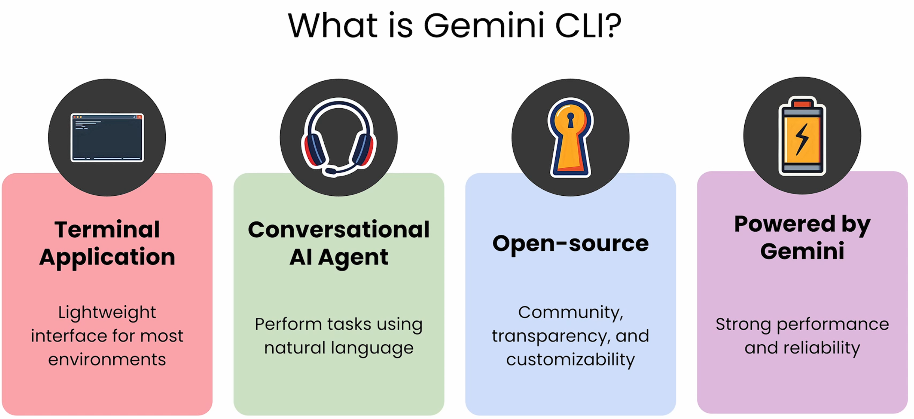

### 1. 终端应用 (Terminal Application)

- **核心内涵：** 它是一个运行在“终端”或“命令行”环境下的程序（类似于 Windows 的 CMD、PowerShell 或 Linux/Mac 的 Terminal）。
- **优势：** 描述中提到“适用于大多数环境的轻量级界面”。这意味着它不需要复杂的图形界面，占用资源少，且开发者可以在编写代码或管理系统时直接调用，非常高效。

### 2. 对话式 AI 代理 (Conversational AI Agent)

- **核心内涵：** 它不仅仅是一个死板的工具，而是一个具备交互能力的 AI 助手。
- **优势：** 描述提到“使用自然语言执行任务”。用户不需要记住复杂的编程命令，可以直接用日常语言（如“帮我写一个 Python 脚本”或“解释这段代码”）来让它完成工作。

### 3. 开源 (Open-source)

- **核心内涵：** 该工具的代码是公开的，任何人都可以查看、使用和修改。
- **优势：** 描述强调了“社区、透明度和可定制性”。**社区：** 开发者可以共同改进它。**透明度：** 用户可以知道代码是如何运行的，更加安全可信。**可定制性：** 企业或个人可以根据自己的特定需求对其进行二次开发。

### 4. 由 Gemini 提供动力 (Powered by Gemini)

- **核心内涵：** 它的底层核心是 Google 开发的 Gemini 大语言模型。
- **优势：** 描述提到“强大的性能和可靠性”。这说明该 CLI 工具继承了 Gemini 模型的高智能、长文本处理能力和快速响应的特性，确保任务执行的质量。

## 二、揭秘：工作原理

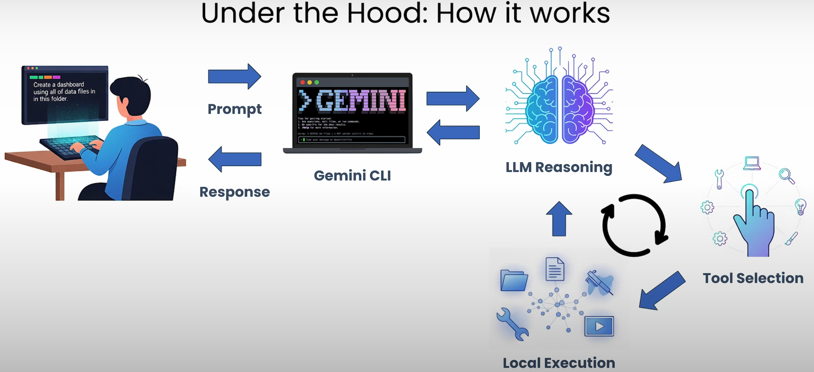

### 1. 输入阶段 (Prompt)

- **用户操作：** 用户在终端输入一个自然语言指令（Prompt）。
- **示例：** 课件中展示的例子是：“Create a dashboard using all of data files in this folder.”（使用这个文件夹里的所有数据文件创建一个仪表板）。
- **载体：** 这个指令被输入到 **Gemini CLI** 应用程序中。

### 2. 推理阶段 (LLM Reasoning)

- **核心：** Gemini CLI 将用户的指令发送给底层的 **LLM（大语言模型）**。
- **过程：** AI 不仅仅是“回答问题”，它在进行“推理”。它会分析：用户想要什么？我需要访问哪些文件？我该用什么工具来完成这个任务？

### 3. 工具选择与决策循环 (The Agentic Loop)

这是最关键的部分，展示了它作为一个“Agent（代理）”的能力：

- **Tool Selection (工具选择)：** AI 根据推理结果，决定使用哪些工具。例如：读取文件列表的工具、运行 Python 脚本的工具、或者绘图工具。
- **Local Execution (本地执行)：** 这是 Gemini CLI 的强大之处。它会**在你的本地计算机上**实际执行操作。比如打开文件夹、读取 CSV 数据、生成代码并运行。
- **循环过程 (Iterative Process)：** 图中的圆形箭头表示这是一个迭代循环。AI 执行完一个动作后，会看到结果，如果不满足要求或需要下一步，它会再次进行“推理 -> 选择工具 -> 执行”，直到任务完成。

### 4. 反馈阶段 (Response)

- 一旦任务处理完毕（例如仪表板的代码已生成并运行成功），Gemini CLI 会将最终结果或确认信息返回给用户。

### 5. 总结：它的工作模式

这张图揭示了 Gemini CLI 与普通聊天机器人（如 ChatGPT 网页版）的区别：

- **普通 AI：** 只能说话，不能动你的文件。
- **Gemini CLI：** 它既能“思考”（Reasoning），又能“动手”（Local Execution）。它就像一个坐在你电脑前的初级程序员，听你的口令，然后在你的系统里帮你把活儿干了。

**一句话总结：** 用户下令 -> AI 思考并拆解步骤 -> AI 在本地调用工具执行任务 -> 任务完成并反馈。

## 三、终端优势

### 第一页：基础核心优势

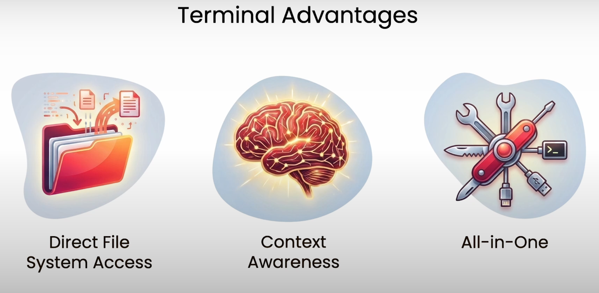

1. **Direct File System Access（直接访问文件系统）****含义：** Gemini CLI 可以直接读取和写入你电脑上的文件夹和文件。**优势：** 你不需要手动把代码或文档复制粘贴到浏览器里。你可以直接下令：“重构当前文件夹下的所有 Python 文件”，它就能直接操作，极大提高了处理本地项目的效率。
2. **Context Awareness（上下文感知）****含义：** 它“知道”你当前所处的环境。**优势：** 它了解你当前所在的目录、项目结构、安装的依赖库以及环境变量。这使得 AI 提供的建议不再是泛泛而谈，而是基于你当前工作内容的“精准定制”。
3. **All-in-One（全能工具箱 / 一站式）****含义：** 就像图中展示的瑞士军刀，终端是一个集大成者。**优势：** 开发者的大部分工作（写代码、版本控制 Git、部署、测试）都在终端完成。Gemini CLI 让你无需切换窗口，就能在同一个界面内调用 AI 能力，保持工作流的连贯性。

### 第二页：进阶与扩展优势

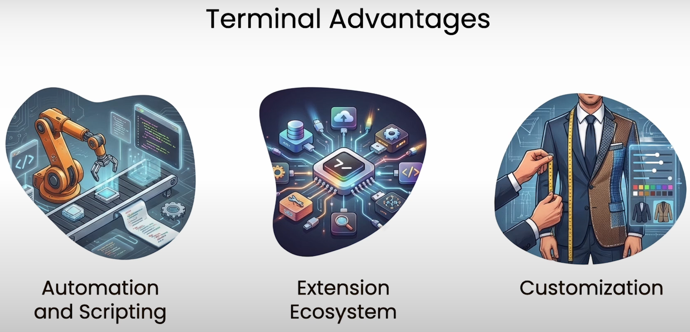

1. **Automation and Scripting（自动化与脚本编写）****含义：** 命令行工具天生支持自动化。**优势：** 你可以将 Gemini CLI 编写进 Shell 脚本或自动化工作流中。例如，可以写一个脚本，每天定时让 AI 扫描代码库中的漏洞并生成报告。这是网页版 AI 很难实现的批量化处理能力。
2. **Extension Ecosystem（扩展生态系统）****含义：** 终端拥有极其丰富的既有工具生态。**优势：** Gemini CLI 可以通过“管道”（Pipe）等方式与其他强大的命令行工具（如 grep, sed, awk, docker 等）结合使用。它不是孤立的，而是可以融入到一个庞大的技术工具链中。
3. **Customization（定制化）****含义：** 像量体裁衣一样，用户可以完全掌控工具的行为。**优势：** 你可以自定义快捷键、设置特定的 AI 角色（Prompt）、调整输出格式，甚至修改其开源代码以完全符合个人或公司的开发规范和审美。

### **总结：**

这两页课件向受众传达了一个核心观点：**Gemini CLI 不仅仅是一个聊天窗口，它是一个深度集成在开发环境中的“超级工具”。** 它通过直接操作文件、感知环境背景、支持自动化和高度定制，将 AI 的能力从“对话”提升到了“生产力执行”的层面。

## 四、内置工具

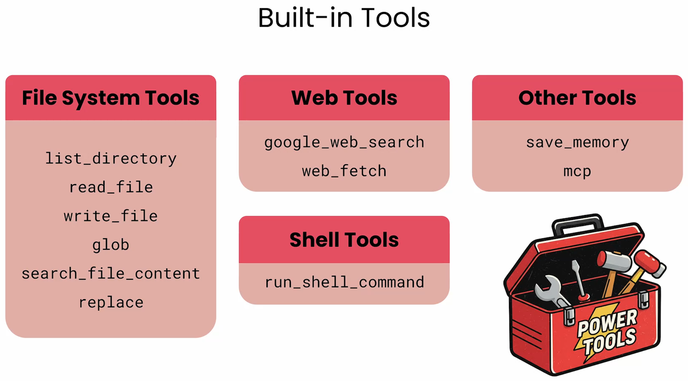

### 1. 文件系统工具 (File System Tools) —— 它的“手”

这些工具允许 Gemini CLI 直接管理你电脑上的文件：

- **list_directory:** 查看文件夹里有哪些文件。
- **read_file / write_file:** 读取文件内容或写入/创建新文件。
- **glob:** 使用通配符（如 *.js）批量查找文件。
- **search_file_content:** 在文件内搜索特定的文字或代码（类似于 grep 命令）。
- **replace:** 替换文件中的特定内容。
- **意义：** 这意味着你可以对它说：“把当前项目里所有的旧版权年份改为 2024”，它会自己去找并修改。

### 2. 网络工具 (Web Tools) —— 它的“眼睛”

让 AI 能够连接互联网，获取实时信息：

- **google_web_search:** 调用谷歌搜索，解决它知识库里没有的最新的技术问题。
- **web_fetch:** 抓取特定网页的内容，用来分析文档或读取 API 说明。

### 3. Shell 工具 (Shell Tools) —— 它的“终极权限”

这是最强大也最核心的功能：

- **run_shell_command:** 它可以直接运行任何终端命令（如 npm install, git commit, docker-compose up 等）。
- **意义：** 只要是你在终端里能手动敲的命令，它都可以根据你的需求自动组合并执行。

### 4. 其他工具 (Other Tools) —— 它的“记忆与扩展”

- **save_memory:** 让 AI 能够记住某些关键信息，在后续的对话或任务中持续使用。
- **mcp (Model Context Protocol):** 这是一个重要的行业标准协议，允许 Gemini 轻松地与更多第三方数据源和外部工具进行标准化连接（这是目前 AI 业界非常热门的扩展协议）。

### **核心总结：**

这张课件揭示了 Gemini CLI 强大的原因：**它拥有一套完整的“生产力工具箱” (Power Tools)。**

- 它能**读写文件**（处理本地项目）；
- 它能**查阅网络**（获取最新知识）；
- 它能**运行命令**（直接部署或编译代码）；
- 它能**记忆与扩展**（变得越来越懂你的需求）。

这使得它成为了一个真正的 **AI 程序员/系统管理员助手**。

## 五、上下文/背景信息

### 第一页：为什么需要 Context？（生活化比喻）

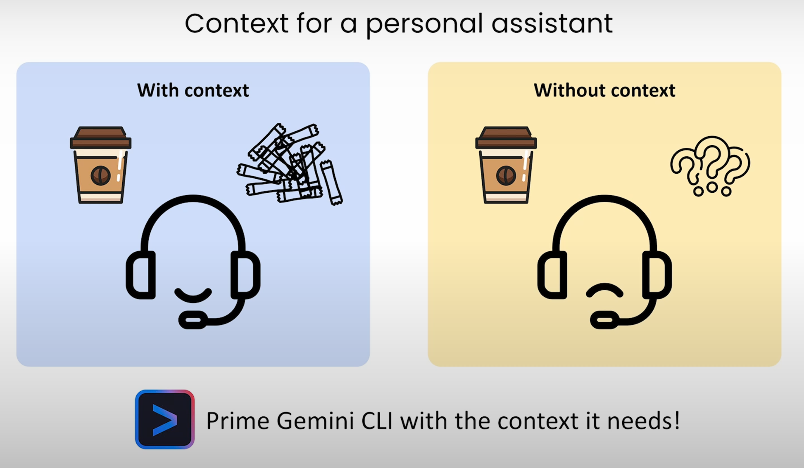

这页通过一个**私人助理买咖啡**的生动比喻，解释了“上下文”的作用：

- **有上下文 (With context)：****情景：** 你对助理说“照旧”。因为助理知道你的口味（比如：大杯、拿铁、加两包糖），他能迅速且准确地完成任务。**结果：** 助理（AI）很开心，任务高效完成，符合预期。
- **没有上下文 (Without context)：****情景：** 你对一个新来的助理说“照旧”。他完全不知道你的习惯，只能对着咖啡杯发愁，满头问号。**结果：** 助理（AI）感到困惑，无法执行任务，或者做出的结果完全不对。
- **结论：** **“Prime Gemini CLI with the context it needs!”**（为 Gemini CLI 提供它所需的背景信息，让它进入最佳工作状态）。这就像是给 AI 提前做“入职培训”。

### 第二页：Context 到底包含什么？（技术化定义）

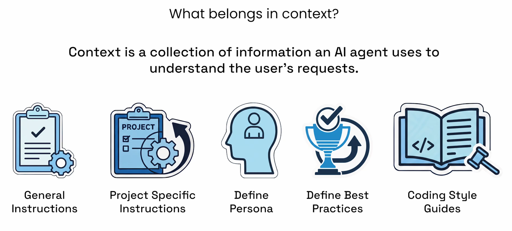

这页给出了定义：**“Context 是 AI 智能体用来理解用户请求的一系列信息的集合。”**

为了让 Gemini CLI 真正好用，你需要为其配置以下五类信息：

1. **General Instructions (通用指令)：**规定 AI 的基本行为准则。例如：“回答要简洁”、“优先使用 Python 编写脚本”或“在执行危险命令前必须询问我”。
2. **Project Specific Instructions (项目特定指令)：**告知 AI 当前项目的具体情况。例如：“这是一个基于 Node.js 的电商后台”、“数据库使用的是 PostgreSQL”。这能防止 AI 给出不切实际的建议。
3. **Define Persona (定义人设)：**设定 AI 的角色。例如：“你是一位拥有 10 年经验的高级安全专家”或“你是一位善于解释底层原理的导师”。人设不同，AI 说话的语气和思考问题的深度也会不同。
4. **Define Best Practices (定义最佳实践)：**告诉 AI 应该遵循哪些行业标准。例如：“代码必须包含单元测试”、“必须遵循 RESTful API 设计规范”。
5. **Coding Style Guides (代码规范指南)：**具体的格式要求。例如：“缩进使用 2 个空格而不是 Tab”、“变量命名使用驼峰命名法（camelCase）”。这样 AI 生成的代码就能直接融入你的项目，无需手动修改格式。

## 六、上下文文件放在哪里？

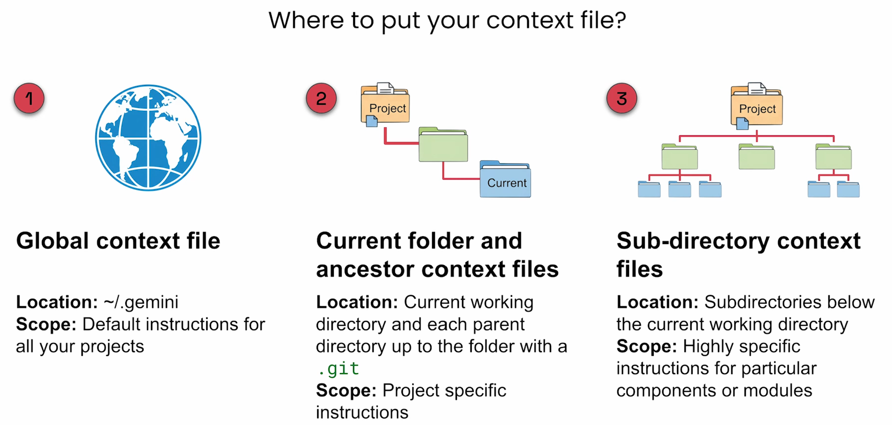

### 1. 全局上下文文件 (Global context file) —— **“放之四海而皆准”**

- **位置：** ~/.gemini (即你电脑的用户根目录下)。
- **作用范围：** 它是**所有项目**的默认指令。
- **使用场景：** 适合存放你希望 AI 永远遵守的习惯。例如：“始终用中文回答我”、“代码缩进统一使用 4 个空格”、“回答要简洁”。无论你是在写网页还是在写脚本，这些规则都会生效。

### 2. 当前文件夹及父级目录上下文文件 (Current folder and ancestor context files) —— **“项目级设置”**

- **位置：** 当前工作的目录，以及向上溯源的所有父目录，直到找到 .git 文件夹（通常是项目的根目录）为止。
- **作用范围：** 针对**特定项目**的指令。
- **使用场景：** 适合存放项目特有的背景。例如，在项目 A 的根目录下放一个文件，告诉 AI：“这是一个使用 React 和 Tailwind CSS 的项目”。这样当你在这个项目里下令时，AI 就会自动根据这些技术栈给出建议。

### 3. 子目录上下文文件 (Sub-directory context files) —— **“模块级精细设置”**

- **位置：** 当前工作目录下的各个子目录。
- **作用范围：** 针对**特定组件或模块**的高精细度指令。
- **使用场景：** 适合更细分的任务。例如：在 /docs 文件夹下放一个文件，要求：“在此文件夹下只使用 Markdown 格式编写文档”。在 /backend 文件夹下放一个文件，要求：“这里的代码必须符合 RESTful API 规范”。

### **核心总结：**

这种设计体现了 **“层级覆盖/叠加”** 的逻辑：

1. **全局层**：定下基本调性。
2. **项目层**：明确技术栈和业务目标。
3. **子目录层**：锁定具体的编码规范或文档标准。

**Gemini CLI 会自动读取这些文件，并将它们合并在一起。** 这样你就不需要每次都在对话里重复：“我这是个 React 项目，请用中文回答，并且要符合 RESTful 规范”，因为它已经从这些分布在不同位置的文件里“学会”了。

## 七、MongoDB 示例

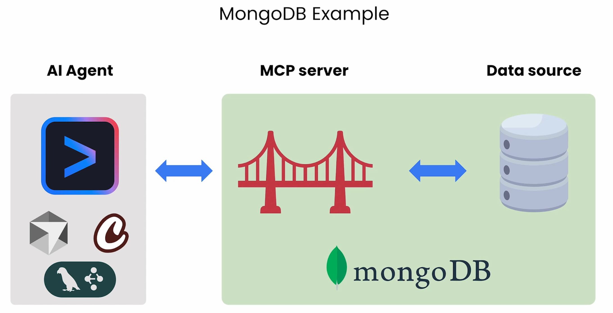

展示了 Gemini CLI 如何通过 **MCP (Model Context Protocol，模型上下文协议)** 与外部数据库（如 MongoDB）进行交互的架构。

这页课件解释了 AI 智能体如何突破自身知识的限制，去获取实时、私有的业务数据。我们可以将其分为三个核心部分来理解：

### 1. AI Agent (AI 智能体 - 左侧)

- **构成：** 这里展示了 **Gemini CLI** 的图标，以及其他常见的 AI 框架图标（如 LangChain、CrewAI 等）。
- **角色：** 它是“大脑”。它负责接收用户的自然语言指令（例如：“帮我分析一下数据库里上个月销售额最高的十个产品”）。
- **痛点：** AI 大模型本身并不直接拥有你的数据库访问权限，也不知道你数据库的结构。

### 2. MCP Server (MCP 服务器/桥梁 - 中间)

- **构成：** 课件使用了**桥梁**的图标，并标注了 **MongoDB**。
- **角色：** 它是**核心连接器**。MCP 是 Anthropic 提出、目前被谷歌等广泛支持的一种开放协议。
- **功能：**它像一个“翻译官”或“适配器”。它告诉 AI Agent：“我这里有一套连接 MongoDB 的工具，你可以调用它们来查询、增加或删除数据。”它将 AI 的意图转化为数据库能理解的指令（如 MQL 查询语句）。

### 3. Data Source (数据源 - 右侧)

- **构成：** 数据库存储图标，代表实际存储数据的 **MongoDB 数据库**。
- **角色：** 它是“仓库”，存放着真实的业务数据、用户信息或日志。

### **工作流程演示：**

1. **用户下令：** 用户在 Gemini CLI 终端输入：“查找数据库中所有状态为‘待处理’的订单。”
2. **AI 思考：** Gemini 意识到需要查看数据库，它发现已经连接了一个 **MongoDB MCP Server**。
3. **协议调用：** Gemini 通过 MCP 协议向服务器发送请求。
4. **数据提取：** MCP Server 执行查询，从 **MongoDB 数据源**中抓取数据。
5. **结果反馈：** 数据传回 Gemini CLI，AI 将原始数据整理成易读的文字或报表显示给用户。

### **核心意义：**

这张课件展示了 Gemini CLI 的**扩展性**。通过 MCP 协议，Gemini CLI 不再只是一个本地工具，它可以连接到任何数据源（数据库、Google Drive、GitHub、Slack 等）。

**总结一句话：MCP 让 Gemini CLI 拥有了访问和操作企业级私有数据（如 MongoDB）的安全桥梁。**

## 八、CLI 与 MCP

### 第一页：Extend Gemini CLI with MCPs (通过 MCP 扩展 Gemini CLI)

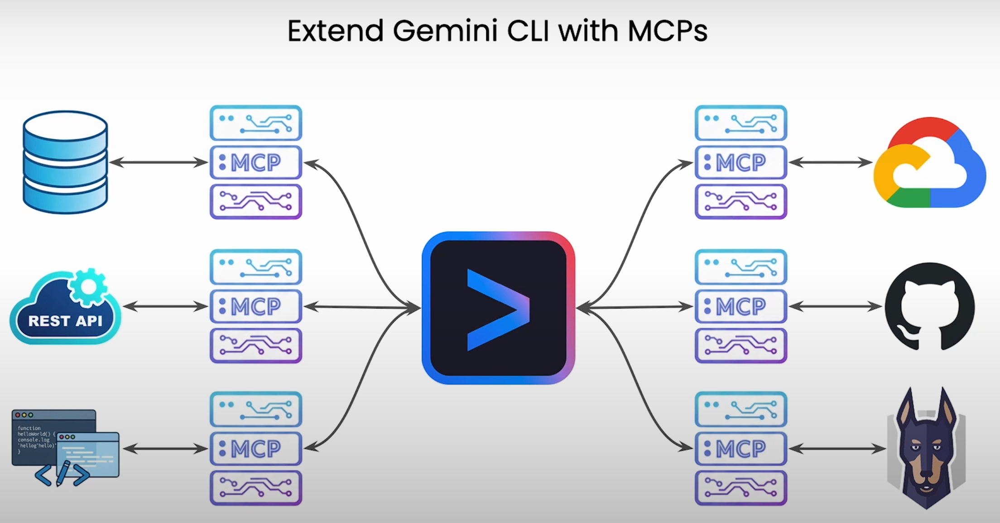

这张图展示了 Gemini CLI 的**连接架构**：

- **中心节点：** 蓝紫色的图标代表 **Gemini CLI**。它是指令的发出者和逻辑的处理中心。
- **MCP 桥梁：** 每一个带有 :MCP 标识的小方块都是一个标准化的连接协议。
- **连接的广度：** 图中展示了 Gemini CLI 可以通过 MCP 触达的各种资源：**数据库 (Database)：** 查询、分析或更新存储的数据。**REST API：** 调用任何开放的互联网服务接口。**本地/云端代码 (Code)：** 理解项目代码、重构代码或生成新功能。**Google Cloud：** 管理云资源、查看部署状态。**GitHub：** 管理代码仓库、拉取 Issue、提交代码（Pull Requests）。**监控与安全 (如 Sentry 图标)：** 实时查看报错日志或系统安全状态。

**核心意义：** Gemini CLI 不再受限于它被训练时的过时知识，它可以通过这些“插槽”获取**最新的、动态的、私有的**各种数据和控制权。

### 第二页：Popular MCP Servers (流行的 MCP 服务器/插件)

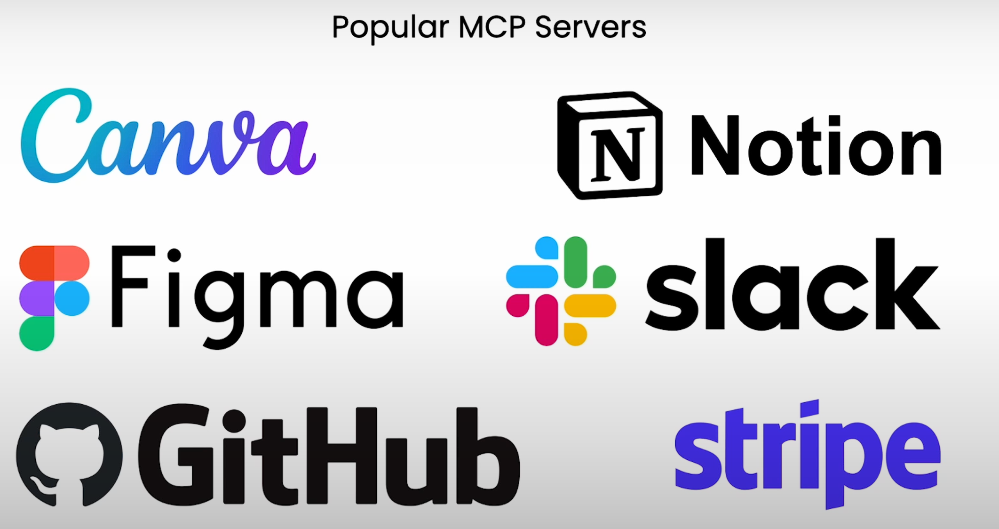

这张图展示了目前已经支持或能够接入 MCP 生态的**主流第三方服务**。这证明了它的强大实用价值：

- **Canva / Figma：** AI 可以辅助进行设计资产的管理或获取设计信息。
- **Notion：** AI 可以读取你的知识库、更新笔记或搜索工作文档。
- **Slack：** AI 可以帮你总结频道里的讨论内容，或者代你发送消息。
- **GitHub：** AI 深入集成开发流程，处理代码审查和版本控制。
- **Stripe：** AI 可以帮你查询支付状态、账单报表或处理财务相关的自动化脚本。

### **总结这两页的整体内涵：**

1. **统一入口：** 你不需要分别打开 Slack、GitHub、Stripe 和 Notion。通过 Gemini CLI，你可以用**一句话**完成跨平台的任务（例如：“总结 Slack 上的讨论，并在 Notion 里创建一个任务清单，顺便查一下 GitHub 上对应的 Bug 修复没”）。
2. **标准化：** MCP 协议的存在，让开发者不需要为每个工具写复杂的适配代码，只要有 MCP Server，Gemini CLI 就能瞬间学会如何操作这些工具。
3. **从“聊天”到“行动”：** 这标志着 AI 从简单的“对话机器人”转变为真正的 **“AI 智能代理 (AI Agent)”**。它不仅有大脑（Gemini 模型），还有了通往各个数字化平台的“触角”和“手脚”。

**一句话总结：这两页告诉我们，Gemini CLI 是一个可以连接你所有工作流程的“万能遥控器”。** 

## 九、Gemini CLI 扩展

这两页课件深入解释了 **Gemini CLI 扩展（Extensions）** 的本质及其丰富的生态系统。

如果说前面的课件介绍了“零件”（如 MCP、上下文文件），那么这两页则介绍了如何将这些零件组装成一个**“开箱即用”的功能包**。

### 第一页：什么是 Gemini CLI 扩展？ (定义与组成)

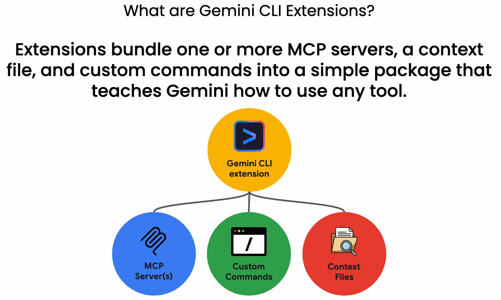

这页给出了官方定义：**“扩展将一个或多个 MCP 服务器、一个上下文文件和自定义命令捆绑成一个简单的包，以此教导 Gemini 如何使用任何工具。”**

它是通过以下三个核心组件“三位一体”实现的：

1. **MCP Server(s) (连接器)：**提供技术接口，让 Gemini 能实际连接到外部软件或数据库（如 GitHub、Google Drive 等）。
2. **Custom Commands (自定义命令)：**为该工具设定特定的快捷动作。例如，针对 Jira 的扩展可能会内置一个“创建 Bug 票据”的专用命令。
3. **Context Files (上下文文件)：**为 Gemini 提供使用说明书。它告诉 AI：“这个工具是什么”、“在什么场景下使用它”以及“输出格式应该是怎样的”。

**核心逻辑：** 扩展就像是给 AI 安装了一个**“技能插件”**。安装后，AI 不仅获得了访问权限，还学会了该工具的领域知识和操作规范。

### 第二页：已有的生态系统 (Available Now)

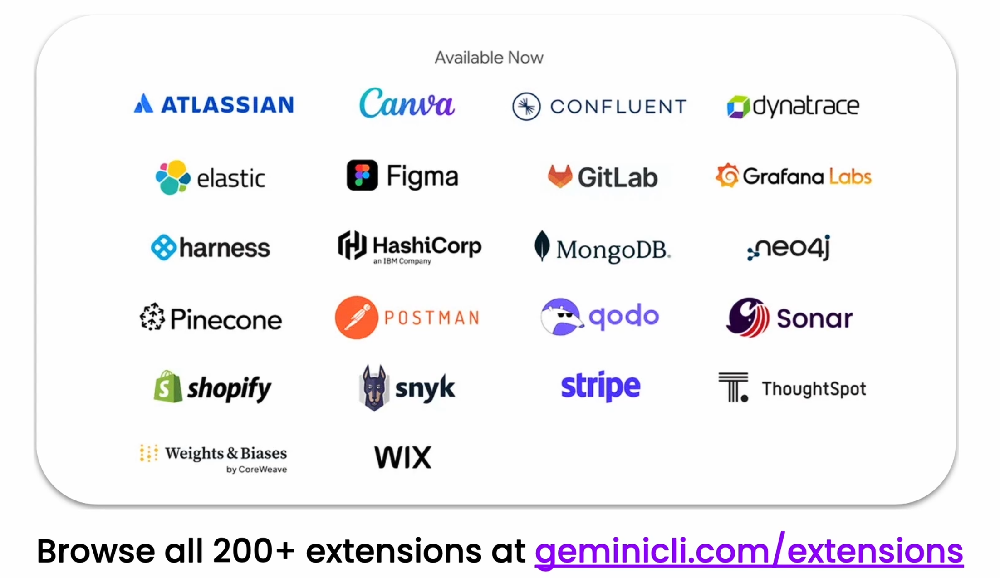

这页展示了 Gemini CLI 强大的落地能力，列出了目前已经可以使用的各种扩展：

- **开发与运维 (DevOps)：** 如 GitLab、GitHub、Postman、Sonar、Snyk、Harness。这让 AI 能深度参与代码审查、安全扫描和测试流。
- **数据库与搜索：** 如 MongoDB、Neo4j、Elastic、Pinecone。AI 可以直接查询和分析非关系型数据或向量数据。
- **企业协作与文档：** 如 Atlassian (Jira/Confluence)、Canva、Figma、Notion。AI 可以处理项目任务、协作绘图或整理笔记。
- **商业与电商：** 如 Shopify、Stripe、Wix。AI 可以辅助管理订单、查看支付状态或更新网站内容。
- **监控与可观测性：** 如 Grafana Labs、Dynatrace。AI 可以辅助分析性能图表和系统警报。

**关键数据：** 底部提到 **“浏览全部 200+ 个扩展”**，并给出了网址 geminicli.com/extensions。这表明该工具已经拥有一个非常成熟且快速增长的开发者社区。

### **总结：**

这两页课件传达了两个关键信息：

1. **封装性：** 扩展将复杂的配置（连接、指令、规范）简化成一个**“包”**，让普通用户只需简单安装就能让 AI 掌握一项专业技能。
2. **平台化：** Gemini CLI 不仅仅是一个 Google 的工具，它正通过这 200 多个扩展，变成一个连接**全网主流技术栈**的通用 AI 调度中心。

**一句话解读：** 扩展让 Gemini 从“懂点编程的聊天机器人”进化成了“精通 200 多种软件工具的超级专家”。

## 十、monday.com 扩展示例

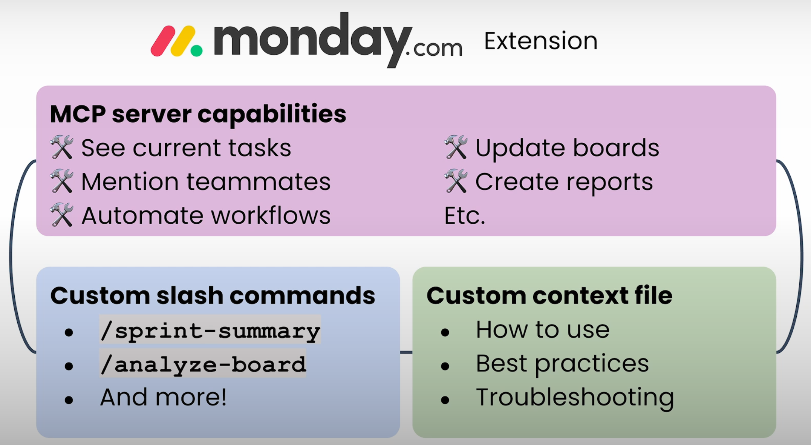

### 1. MCP 服务器能力 (MCP server capabilities) —— “执行手”

这是扩展最底层的能力，决定了 AI **“能做什么”**。通过连接 monday.com 的 API，AI 获得了以下权限：

- **查看当前任务 (See current tasks)：** 实时读取看板上的任务列表。
- **提醒团队成员 (Mention teammates)：** 在任务评论中直接 @ 同事。
- **自动化工作流 (Automate workflows)：** 触发或设置自动化的项目流程。
- **更新看板与创建报告 (Update boards / Create reports)：** 修改任务状态，或者根据数据自动生成周报/月报。

### 2. 自定义斜杠命令 (Custom slash commands) —— “快捷键”

为了提高效率，扩展预设了一些特定的指令，让用户不需要写长句就能执行复杂任务：

- **/sprint-summary：** 快速总结当前冲刺（Sprint）的进展情况。
- **/analyze-board：** 分析看板数据，找出进度滞后的环节或资源分配不均的问题。
- **优势：** 这将原本需要多次查询和思考的复杂操作，简化成了一个简单的命令。

### 3. 自定义上下文文件 (Custom context file) —— “操作指南”

这是写给 Gemini 读的“说明书”，确保 AI 的行为符合预期且专业：

- **如何使用 (How to use)：** 告诉 AI 在什么情况下该调用哪些功能。
- **最佳实践 (Best practices)：** 规定 AI 的回复风格。例如：“在 monday.com 中回复时要保持专业，优先处理标记为‘紧急’的任务”。
- **故障排除 (Troubleshooting)：** 预设一些常见问题的处理方案，防止 AI 在遇到接口报错时不知所措。

### **核心总结：**

这张课件通过 monday.com 的例子告诉我们，一个完整的 Gemini CLI 扩展不仅是**“打通了接口”**（MCP），还**“精简了操作”**（斜杠命令），并**“注入了智慧和规范”**（上下文文件）。

**用户体验：**
你不再需要打开浏览器、登录网页、在看板里点来点去。你只需要在终端输入一行 /sprint-summary，Gemini 就会通过 MCP 抓取数据，根据上下文要求的格式，瞬间为你呈现一份完整的项目报告。
